# The Most Influential Agoran
**Or: An excuse to do a bunch of math on all the assessment data I have**

## 0. ~~Questions I imagined being frequently asked~~ Preamble

### Where do these data come from?
I've been doing using automation for assessments for most of the time that I've been Assessor.

### What time frame do these data cover?
The entire time I've been Assessor (except for my first assessment, which I made by hand) until I was partway done with
this thesis, so roughly from 2019-07-09 to 2021-03-15. This is about a year and half worth of data, which is probably
enough to get a decent grasp of the stats for people who have participated continually through it.

### What are you going to do with these data?
Influencers have been ruining our once-prosperous society by, uhh, influencing.
I'm going to root out the evil influencers so that they can be tracked, imprisoned, and burned at the stake.

I will also write this thesis about it, apparently.

### How are the graphs generated?

They're generated using Jetbrains Let's Plot.

### What about ways to influence the gamestate besides voting-related things?
They exist, but they're not in the data I have. Sorry :P.

### Who did you think the biggest influencer would be before starting this?
G. E is one of the players that has been around the longest, and e seems to participate significantly in most areas of
the game that e can. E therefore seems likely to the biggest, most terrible influence of them all.

## 1. Proposals

Proposals are necessary for nomics to function and can make significant changes on the gamestate, so clearly proposals
will make the submitter more influential.

### 1.0 A Chart

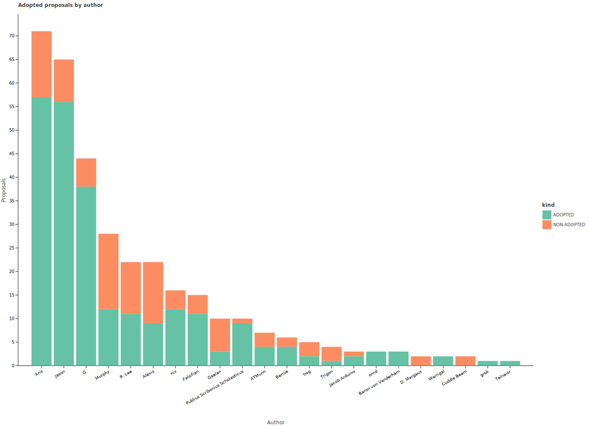

### 1.1 Submitted Proposals

The simplest metric for proposals is how many were submitted by each person. Proposals that were submitted but never
voted on will be ignored because they have no influence on the game, except to increase the Promotor's workload. The
number of proposals that were voted on, though, increases *my* workload, which is clearly much more important.

[Data in plain text](statistics/author_written.txt)

|                          Author |        Written |
| :------------------------------ | -------------: |
|                            Aris |             71 |
|                           Jason |             65 |
|                              G. |             44 |
|                          Murphy |             28 |
|                          R. Lee |             22 |
|                          Alexis |             22 |
|                             nix |             16 |
|                       Falsifian |             15 |
|                          Gaelan |             10 |
| Publius Scribonius Scholasticus |             10 |
|                          ATMunn |              7 |
|                          Bernie |              6 |
|                             twg |              5 |
|                          Trigon |              4 |
|                   Jacob Arduino |              3 |
|                             omd |              3 |
|             Baron von Vanderham |              3 |
|                      D. Margaux |              2 |
|                        Warrigal |              2 |
|                     Cuddle Beam |              2 |
|                            grok |              1 |
|                        Telnaior |              1 |

It appears that Aris and Jason are in a relatively close first and second for number of proposals submitted, with G.
coming in as a not-too-distant third. They are followed by most of the people who have been relatively active throughout
the entire time I've been Assessor, with a few notable exceptions. First is Alexis, who managed to write 22 proposals in
from 2020-01-06 to 2020-05-03, or just over 5 per month, reaching a tie for 5th place. These data also show people who
submit relatively few proposals: Trigon, omd, and Cuddle Beam. Luckily for them, they are not dirty influencers by this
metric and are, for now, safe.

**MOST INFLUENTIAL: Aris**

### 1.2 Adopted Proposals

Though all proposals have some impact on the game, for example by requiring the Promotor to distribute them, people to
vote on them, and the Assessor to collect votes, proposals that are adopted have far more impact, as they actually
have the chance to change the gamestate in some way, unlike all of those lazy rejected proposals.

[Data in plain text](statistics/author_adopted.txt)

|                          Author |        Adopted |
| :------------------------------ | -------------: |
|                            Aris |             57 |
|                           Jason |             56 |
|                              G. |             38 |
|                          Murphy |             12 |
|                          R. Lee |             11 |
|                          Alexis |              9 |
|                             nix |             12 |
|                       Falsifian |             11 |
|                          Gaelan |              3 |
| Publius Scribonius Scholasticus |              9 |
|                          ATMunn |              4 |
|                          Bernie |              4 |
|                             twg |              2 |
|                          Trigon |              1 |
|                   Jacob Arduino |              2 |
|                             omd |              3 |
|             Baron von Vanderham |              3 |
|                      D. Margaux |              0 |
|                        Warrigal |              2 |
|                     Cuddle Beam |              0 |
|                            grok |              1 |
|                        Telnaior |              1 |

[Note: this table is sorted in the same order as the previous (in order of descending proposals submitted).]

These data, unfortunately, do not appear to be much more informative than the data about submitted proposals. They
mostly follow the same patterns as above. This can be seen by the numbers generally decreasing down the chart (since the
persons are sorted in descending order of proposals submitted). Once again, Aris and Jason are nearly tied at the top
spot for proposal influence.

The noticeable break in the pattern around Gaelan and PSS suggests that either Gaelan's proposals are unusually likely
to be rejected or that PSS's proposals being unusually likely to be adopted. This can be further examined in the next
section.

**MOST INFLUENTIAL: Aris**

### 1.3 Proposal Adoption Rate

Perhaps, instead of looking at absolute numbers for adoption, it would be better to look at the fraction of proposals
authored that they are able to get adopted. A very high proposal adoption rate would imply that when a person endorses
an idea enough to propose, people tend to agree with them, meaning they could have influenced others' opinions, thereby
becoming an influencer. 

[Data in plain text](statistics/author_adopted_rate.txt)

|                          Author |       Adoption rate |
| :------------------------------ | ------------------: |
|                            Aris |                0.80 |
|                           Jason |                0.86 |
|                              G. |                0.86 |
|                          Murphy |                0.43 |
|                          R. Lee |                0.50 |
|                          Alexis |                0.41 |
|                             nix |                0.75 |
|                       Falsifian |                0.73 |
|                          Gaelan |                0.30 |
| Publius Scribonius Scholasticus |                0.90 |
|                          ATMunn |                0.57 |
|                          Bernie |                0.67 |
|                             twg |                0.40 |
|                          Trigon |                0.25 |
|                   Jacob Arduino |                0.67 |
|                             omd |                1.00 |
|             Baron von Vanderham |                1.00 |
|                      D. Margaux |                0.00 |
|                        Warrigal |                1.00 |
|                     Cuddle Beam |                0.00 |
|                            grok |                1.00 |
|                        Telnaior |                1.00 |

These data show that the people who propose the very most (Aris, Jason, and G.) all have approximately the same proposal
adoption rate (in the ballpark of 85%), with Aris lagging behind slightly. Below those three, adoption rates vary
significantly. Noticeably, PSS has a higher adoption rate (90%) than the top three (and much higher than the people who
have written similar numbers of proposals to em), though e has only written 10 proposals, so this doesn't indicate a
real difference in influence. Below that point, the total proposal numbers again become too small to really draw
conclusions, and they give very extreme rates.

**MOST INFLUENTIAL: PSS**

### 1.4 Proposal Adopted Length

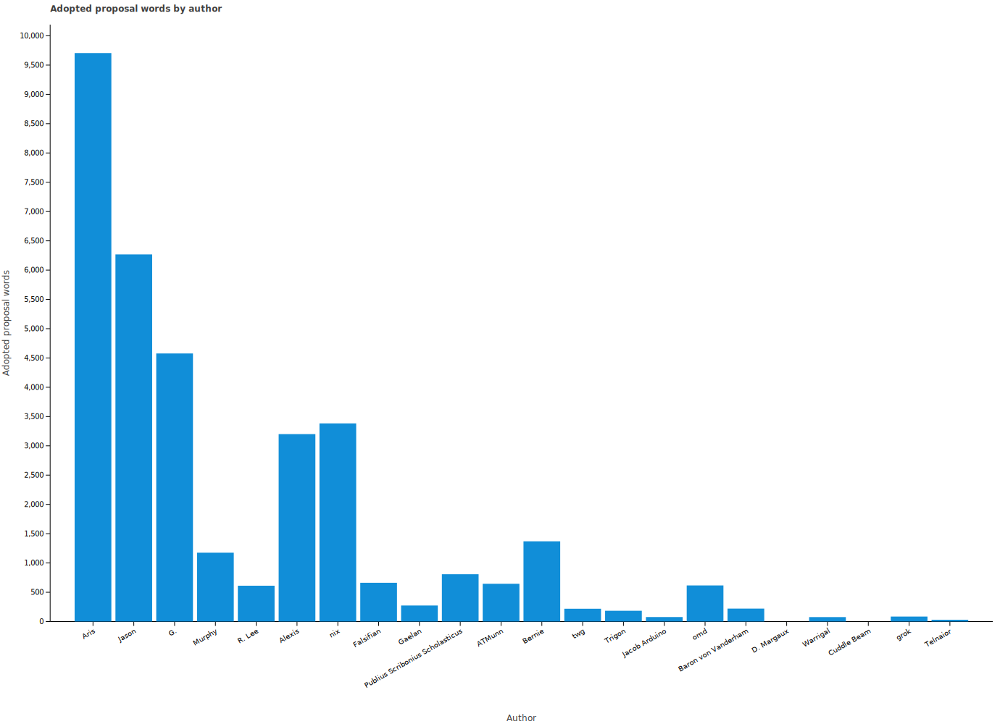

Clearly, not all proposals are created equal. A minor bug fix will be less influential on the gamestate than a proposal
that rewrites several core rules. One metric for this is the total adopted word count of proposals by author; this is
not necessarily a *good* metric, but it is nevertheless *a* metric. The proposal length likely also roughly correlates
with how much work people have to do writing and reviewing it, meaning that people who have authored more words have
had more influence on the other players.

[Data in plain text](statistics/author_adopted_words.txt)

|                          Author |        Adopted Words |
| :------------------------------ | -------------------: |
|                            Aris |                 9706 |
|                           Jason |                 6268 |
|                              G. |                 4577 |
|                          Murphy |                 1175 |
|                          R. Lee |                  612 |
|                          Alexis |                 3200 |
|                             nix |                 3383 |
|                       Falsifian |                  662 |
|                          Gaelan |                  274 |
| Publius Scribonius Scholasticus |                  808 |
|                          ATMunn |                  645 |
|                          Bernie |                 1370 |
|                             twg |                  219 |
|                          Trigon |                  184 |
|                   Jacob Arduino |                   77 |
|                             omd |                  617 |
|             Baron von Vanderham |                  221 |
|                      D. Margaux |                    0 |
|                        Warrigal |                   76 |
|                     Cuddle Beam |                    0 |
|                            grok |                   85 |
|                        Telnaior |                   31 |

Unlike the previous metrics, this metric has a clear leader - Aris, who has written more than 3000 more adopted words
than the next closest competitor. As is probably to be expected, the amount of words adopted roughly decreases with
the number of proposals submitted, though there are a few outliers. Alexis and nix have written thousands more adopted
words than the people who have written similar numbers of proposals.

Looking more into the specific proposals of each, the vast majority of Alexis's adopted words (2447 of them) come from a
single proposal - P8354 "Statutory Instrumentation". This is a proposal that rewrites and adds many core rules, so it
makes sense that it is relatively long. This proposal is also known for creating a fiendishly complicated system that
was meant to be extensible but was never actually extended.

The majority of nix's adopted words (1190 and 781, totaling 1971) come from two proposals - P8408 "Sets v1.4" and
P8515 "adMinistration v1.1". "Sets" was an entirely new economy, and "adMinistration" changed a core part of that
economy, so it makes sense for both of them to be relatively long.

**MOST INFLUENTIAL: Aris**

### 1.5 Proposal Strength Margins

Let the margin of a resolution to be F - AI*A, where F is the strength FOR, A is the strength AGAINST, and AI is the
adoption index of the decision. This means that a non-negative margin results in adoption (except for 0 margin on an
AI-1 proposal), while a negative margin results in rejection. Thus, a person whose proposals achieve higher voting
strength margins will find it easier to pass proposals, making them more influential.

#### 1.5.1 Total Proposal Strength Margins

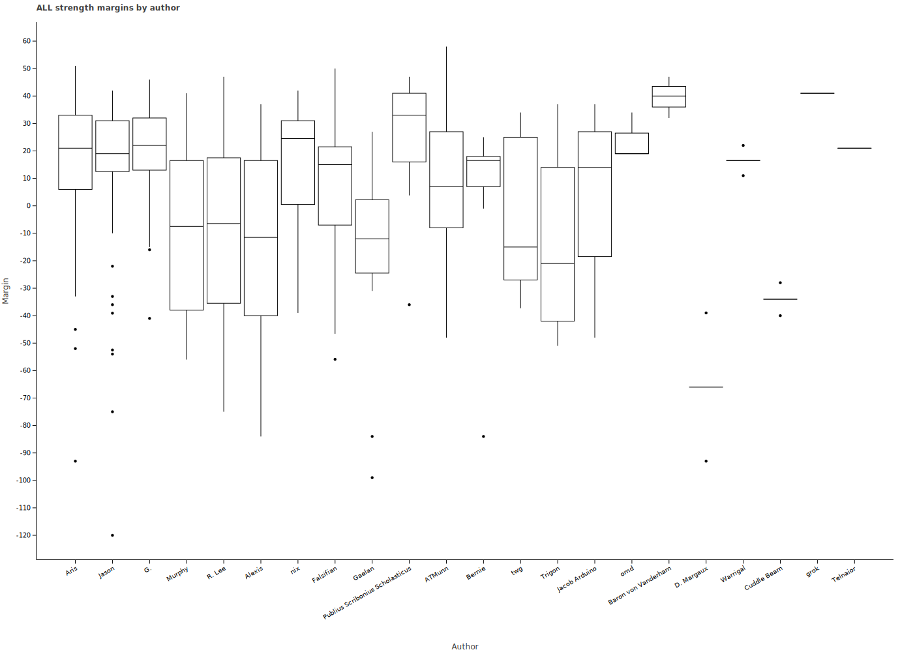

[Data in plain text](statistics/author_avg_all_strength_margin.txt)

|                          Author | Author avg strength margin (all proposals) |
| :------------------------------ | -----------------------------: |
|                            Aris |                          14.27 |
|                           Jason |                          14.46 |
|                              G. |                          20.63 |
|                          Murphy |                          -9.44 |
|                          R. Lee |                          -8.87 |
|                          Alexis |                         -13.86 |
|                             nix |                          15.81 |
|                       Falsifian |                           7.64 |
|                          Gaelan |                         -21.56 |
| Publius Scribonius Scholasticus |                          24.18 |
|                          ATMunn |                           7.86 |
|                          Bernie |                          -1.50 |
|                             twg |                          -4.06 |
|                          Trigon |                         -14.00 |
|                   Jacob Arduino |                           4.25 |
|                             omd |                          24.00 |
|             Baron von Vanderham |                          39.67 |
|                      D. Margaux |                         -66.00 |
|                        Warrigal |                          16.50 |
|                     Cuddle Beam |                         -34.00 |
|                            grok |                          41.00 |
|                        Telnaior |                          21.00 |

These data (primarily the boxplot) show that the three people who have written the most proposals have relatively
similar margins in the middle 50% of their proposals, with Aris having a somewhat wider range, and G. having a somewhat
higher-margin middle 50%, suggesting eir proposals receive slightly more consensus than the other two's, although all
three manage to have a positive first quartile. This suggests that the people who write the most proposals tend to be
fairly good at it, usually getting their proposals to pass with a decent margin. Beyond those three, median and Q1/3
margins become significantly less positive, except for nix, who has achieved a non-negative Q1 margin, and PSS, who
manages to have a higher median, mean, Q1, and Q3 than G., albeit while writing significantly fewer proposals, making em
the most influential.

**MOST INFLUENTIAL: PSS**

#### 1.5.2 Adopted Proposal Strength Margin

In addition to looking at voting strength margins over all proposals, we can also look at margins over only adopted
proposals. This provides a sense of how much agreement an author is able to muster on proposals, i.e. whether they
pass convincingly or squeak by. This is a more refined measure than looking at margins over all proposals, because it
doesn't provide a sense of how often proposals pass, just how strongly they pass when they do.

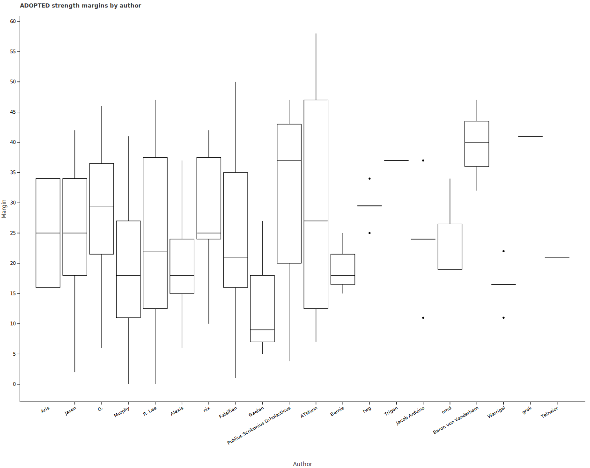

[Data in plain text](statistics/author_avg_adopted_strength_margin.txt)

|                          Author | Avg strength margin (adopted proposals) |
| :------------------------------ | ---------------------------------: |
|                            Aris |                              24.30 |
|                           Jason |                              25.18 |
|                              G. |                              27.94 |
|                          Murphy |                              19.17 |
|                          R. Lee |                              23.20 |
|                          Alexis |                              20.22 |
|                             nix |                              28.17 |
|                       Falsifian |                              23.91 |
|                          Gaelan |                              13.67 |
| Publius Scribonius Scholasticus |                              30.87 |
|                          ATMunn |                              29.75 |
|                          Bernie |                              19.00 |
|                             twg |                              29.50 |
|                          Trigon |                              37.00 |
|                   Jacob Arduino |                              24.00 |
|                             omd |                              24.00 |
|             Baron von Vanderham |                              39.67 |
|                        Warrigal |                              16.50 |
|                            grok |                              41.00 |
|                        Telnaior |                              21.00 |

Comparing this to the previous section shows that it differs far more for authors with lower proposal adoption rates,
which makes sense -- they have fewer data points that will be removed. For instance, with the three most common authors
(who all have relatively high adoption rates), the relative values are the same, but the plots are just shifted upwards.
The next three most common authors are much closer to the previous three than they were over all proposals.

PSS is once again the most influential, achieving the highest mean margin (of those that have written a non-trivial
number of proposals).

The proposal with the highest strength margin is P8507 by ATMunn, with a margin of 58:
```
PROPOSAL 8507 (Happy Belated Birthday v3)
AUTHOR: ATMunn
CLASS: ORDINARY
CHAMBER: PARTICIPATION
SPONSORED: YES
FOR (14): ATMunn&, Aris, Baron von Vanderham, D. Margaux, Falsifian, G.*, Gaelan@, Jason%, Publius Scribonius Scholasticus&, Telnaior, Trigon, nix%, sukil, twg
AGAINST (0): 
PRESENT (0): 
BALLOTS: 14
AI (F/A): 58/0 (AI=1.0)
POPULARITY: 1.000
OUTCOME: ADOPTED
```

```
ID: 8507
Title: Happy Belated Birthday v3
Adoption index: 1.0
Author: ATMunn
Co-authors: G., Falsifian


Amend Rule 2585, "Birthday Gifts", by deleting the sentence "Every time
it is a player's Agoran Birthday, each of the other players CAN once
grant em 3 coins by announcement.", and inserting the following
paragraph in its place:

  During a player's Agoran Birthday and the 7 days following, each
  other player CAN, once, grant em X coins, where X is 3 if it is
  actually the day of the player's birthday, and 2 otherwise.

[This simplifies the rule change and fixes the bugs mentioned by
Falsifian. There's no real reason to prevent players from granting the
belated birthday gift just because people already granted the birthday
gift.]
```

It makes sense that something like this has the highest margin. It's a simple proposal with a reasonable change to a
low power rule; what's not to like?

**MOST INFLUENTIAL: PSS**

#### 1.5.3 Rejected Proposal Strength Margin

The strength margins for rejected proposals by each author show how much an author's proposals fail by when they do
fail. A person who has margins closer to zero (indicating the proposals were closer to passing) will be deemed to be
more influential, as it means they were generally closer to getting their failed proposals to pass.

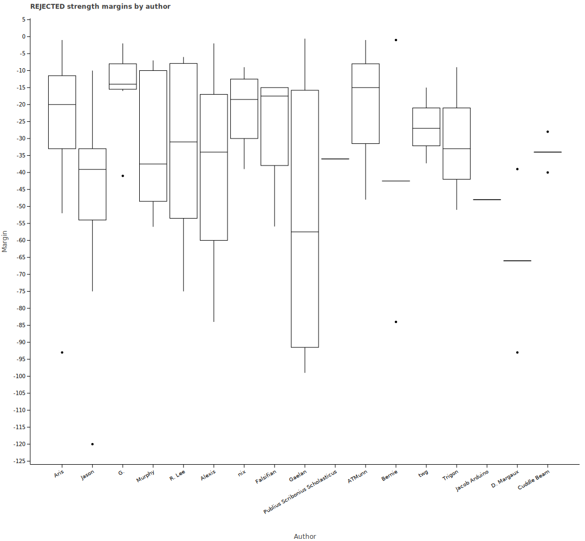

[Data in plain text](statistics/author_avg_rejected_strength_margin.txt)

|                          Author | Avg strength margin (rejected proposals) |
| :------------------------------ | ----------------------------------: |
|                            Aris |                              -26.50 |
|                           Jason |                              -49.07 |
|                              G. |                              -15.00 |
|                          Murphy |                              -32.19 |
|                          R. Lee |                              -34.29 |
|                          Alexis |                              -37.46 |
|                             nix |                              -21.25 |
|                       Falsifian |                              -26.48 |
|                          Gaelan |                              -53.65 |
| Publius Scribonius Scholasticus |                              -36.00 |
|                          ATMunn |                              -21.33 |
|                          Bernie |                              -42.50 |
|                             twg |                              -26.43 |
|                          Trigon |                              -31.00 |
|                   Jacob Arduino |                              -48.00 |
|                      D. Margaux |                              -66.00 |
|                     Cuddle Beam |                              -34.00 |

Once again, the changes seem to depend on what fraction of a person's proposals were adopted, but the graph maintains
the same basic patterns as the graph over all proposals (except for the top three, where Jason's bar has shifted far
towards negative infinity, and G.'s has shifted towards zero, both relative to the other bars around them). Other than
that, some bars (notably Jason and Gaelan) have shifted down as low data points that were outliers when part of the
entire set of resolutions ceased to be outliers, elongating the box and whiskers. Looking at the boxplot and at the
means, there is no question. G. is the author that is most able to get eir failed proposals to be closer to passing.

The proposal with the lowest strength margin was P8237 by Jason, with a margin of -120:
```
PROPOSAL 8237 (Repairing Defeated Spaceships v3)
AUTHOR: Jason
FOR (0): 
AGAINST (13): ATMunn, Aris, Bernie, Falsifian, G.$, Gaelan, Jacob Arduino, Jason, Murphy, Rance, Trigon, o, twg
PRESENT (0): 
BALLOTS: 13
AI (F/A): 0/40 (AI=3.0)
POPULARITY: -1.000
OUTCOME: REJECTED
```
This proposal made a change to a subgame that was previously repealed (but the proposal still went up for a vote after
that because it failed quorum before), so it was unanimously voted against. However, this proposal should really only
have received a margin of -40 because its adoption index was 1.0 at submission, but was ratified at 3.0.

The proposal with the next lowest margin was P8512 by Gaelan, with a margin of -99:
```
PROPOSAL 8512 (Lime Debait)
AUTHOR: Gaelan
CLASS: DEMOCRATIC
SPONSORED: YES
FOR (0): 
AGAINST (11): Aris, Baron von Vanderham, D. Margaux, Falsifian, G.$, Gaelan@, Jason, Publius Scribonius Scholasticus, Telnaior, nix, twg
PRESENT (3): ATMunn, Trigon, sukil
BALLOTS: 14
AI (F/A): 0/33 (AI=3.0)
POPULARITY: -0.786
OUTCOME: REJECTED
```

The proposal itself:
```
ID: 8512
Title: Lime Debait
Adoption index: 3.0
Author: Gaelan
Co-authors: Jason


In Rule 2438 "Ribbons", replace the paragraph beginning "Lime,"
  replace "three or more proposals" with "three or more proposals with
  different authors".
```

At first glance, this looks like a fine proposal, and it would be strange for it to receive such a consensus against.
However, during the voting period, PSS cast the following vote:
```
AGAINST: This proposal is malformed and unclear on what is being replaced.
```
This resulted in several people changing their votes to AGAINST, and others voting AGAINST or endorsing Gaelan as the
author, who voted AGAINST.

**MOST INFLUENTIAL: G.**

## 2. Voting

### Or: The other half of the data I have.

### 2.1 Number of Votes

Proposals are how the players influence the game, but voting is how the players influence the outcome of proposals,
meaning that a person who has cast more votes has had more influence on the gamestate than a person who has cast
fewer votes.

[Data in plain text](statistics/voter_votes.txt)

|                           Voter | Vote count |
| :------------------------------ | ----------: |
|                           Jason |         371 |
|                       Falsifian |         363 |
|                              G. |         302 |
|                            Aris |         283 |
|                             twg |         232 |
|                          Murphy |         221 |
|                          Trigon |         209 |
|                          ATMunn |         179 |
|                             nix |         174 |
| Publius Scribonius Scholasticus |         155 |
|                          R. Lee |         151 |
|                          Gaelan |         120 |
|                           Rance |         118 |
|                          Bernie |         105 |
|                          Alexis |          97 |
|                        Telnaior |          75 |
|                     Cuddle Beam |          74 |
|                             omd |          73 |
|                           sukil |          63 |
|                   Jacob Arduino |          61 |
|                               o |          61 |
|                          Tcbapo |          56 |
|                      D. Margaux |          52 |
|                        Warrigal |          42 |
|             Baron von Vanderham |          29 |
|                           pikhq |          20 |
|                          Halian |          19 |
|                               L |          19 |
|                          Walker |           5 |
|                     Tarhulindur |           5 |
|                        lucidiot |           5 |
|                            JTAC |           4 |
|                            Noah |           2 |
|                         Shy Owl |           1 |

The total number of decisions that could be voted on was 374.

There are two voters who have voted on nearly every possible decision - Jason and Falsifian. Beneath them, the numbers
drop relatively quickly. Some of this is due to not voting on every decision possible, while some of this is due to
the voters not being players for the entire period that these data cover (or being zombies for part of it).

**MOST INFLUENTIAL: Jason**

### 2.2 Voting Strength

Voting strength determines how much a person's vote counts when evaluating outcomes. There have been multiple ways of
determining strength during my time as Assessor. It was originally just a penalty for holding blots, plus a single
strength point bonus for the Speaker. Then, the Ministries system was enacted, which granted voting strength bonuses
to most offices for some proposals, based on the category of the proposal and of the office. After that, Extra Votes
were enacted in the Sets economy. EVs provided a single strength point bonus on a single proposal. Just before
writing this thesis, ministries were repealed and EVs were changed to affect strength on all proposals in their voting
period, not just one, and the Speaker bonus was repealed. The only constants have been the default of three and the one
point penalty for every three blots.

#### 2.2.1 Maximum Voting Strength

[Data in plain text](statistics/voter_strength_max.txt)

|                          Voter | Maximum voting strength achieved |
| :------------------------------ | -----------------: |
|                           Jason |                 10 |
|                       Falsifian |                  6 |
|                              G. |                  8 |
|                            Aris |                  7 |
|                             twg |                  9 |
|                          Murphy |                  5 |
|                          Trigon |                 10 |
|                          ATMunn |                  8 |
|                             nix |                  8 |
| Publius Scribonius Scholasticus |                  7 |
|                          R. Lee |                  6 |
|                          Gaelan |                  3 |
|                           Rance |                  3 |
|                          Bernie |                  3 |
|                          Alexis |                  5 |
|                        Telnaior |                  3 |
|                     Cuddle Beam |                  6 |
|                             omd |                  5 |
|                           sukil |                  3 |
|                   Jacob Arduino |                  3 |
|                               o |                  3 |
|                          Tcbapo |                  3 |
|                      D. Margaux |                  3 |
|                        Warrigal |                  3 |
|             Baron von Vanderham |                  3 |
|                           pikhq |                  3 |
|                          Halian |                  3 |
|                               L |                  3 |
|                          Walker |                  3 |
|                     Tarhulindur |                  3 |
|                        lucidiot |                  3 |
|                            JTAC |                  5 |
|                            Noah |                  3 |
|                         Shy Owl |                  3 |

[Note: the table is sorted so that the people with the most votes appear first.]

Looking at the table, it appears that the highest voting strengths tend to come from the people who vote relatively
frequently. This makes sense -- they are participating in the game more, so they are more likely to do things that
increase their voting strength. This was a significant effect with ministries, since officers tend (ideally) to be
fairly active, and they received voting strength bonuses for their work.

Notably, two people have achieved a voting strength of 10, over three times the default strength, and the maximum that
has been recorded over this time period.

Trigon has achieved this 5 times, each time as follows:
```
3 | Initial
4 | Bonus of 1 for holding Speaker
6 | Bonus of 2 for Speaker's interest in Economy
8 | Bonus of 2 for Treasuror's interest in Economy
10 | Bonus of 2 for Treasuror's interest in Economy
```
Yes, Treasuror receiving two interest bonuses is intentional. This was done in order to compensate the Treasuror for
eir hard work, and because no other interest seemed to fit eir role. Speaker received an interest bonus on ordinary
proposals (those which ministry bonuses affect) in addition to eir global one-point bonus.

Jason reached a voting strength of 10 only once:
```
 3 | Initial
 4 | Bonus of 1 for holding Speaker
 6 | Bonus of 2 for Assessor's interest in Legislation
 8 | Bonus of 2 for Rulekeepor's interest in Legislation
10 | Bonus of 2 for Speaker's interest in Legislation
```
This is similar to Trigon's, but using two different office interests instead of a single double office interest.

**MOST INFLUENTIAL: Trigon**

#### 2.2.2 Minimum Voting Strength

[Data in plain text](statistics/voter_strength_min.txt)

|                          Voter | Minimum voting strength achieved |
| :------------------------------ | -----------------: |
|                           Jason |                  3 |
|                       Falsifian |                  3 |
|                              G. |                  3 |
|                            Aris |                  3 |
|                             twg |                  1 |
|                          Murphy |                  2 |
|                          Trigon |                  3 |
|                          ATMunn |                  3 |
|                             nix |                  3 |
| Publius Scribonius Scholasticus |                  3 |
|                          R. Lee |                  0 |
|                           Rance |                  3 |
|                          Gaelan |                  2 |
|                          Bernie |                  3 |
|                          Alexis |                  3 |
|                        Telnaior |                  3 |
|                             omd |                  3 |
|                     Cuddle Beam |                  3 |
|                           sukil |                  3 |
|                   Jacob Arduino |                  3 |
|                               o |                  3 |
|                          Tcbapo |                  3 |
|                      D. Margaux |                  3 |
|                        Warrigal |                  3 |
|             Baron von Vanderham |                  3 |
|                           pikhq |                  3 |
|                          Halian |                  3 |
|                               L |                  3 |
|                          Walker |                  3 |
|                     Tarhulindur |                  3 |
|                        lucidiot |                  3 |
|                            JTAC |                  3 |
|                         Shy Owl |                  3 |

Unfortunately, this is not particularly illuminating. This is basically a table of who has ever had enough blots to
receive a penalty (without any bonuses that would counter that effect).

**MOST INFLUENTIAL: nobody, really**

#### 2.2.3 Average Voting Strength

[Data in plain text](statistics/voter_strength_avg.txt)

|                          Voter | Average voting strength |
| :------------------------------ | -----------------: |
|                           Jason |               3.67 |
|                       Falsifian |               3.18 |
|                              G. |               4.11 |
|                            Aris |               3.58 |
|                             twg |               3.14 |
|                          Murphy |               3.09 |
|                          Trigon |               3.95 |
|                          ATMunn |               3.49 |
|                             nix |               3.59 |
| Publius Scribonius Scholasticus |               3.79 |
|                          R. Lee |               2.59 |
|                          Gaelan |               2.80 |
|                           Rance |               3.00 |
|                          Bernie |               3.00 |
|                          Alexis |               3.29 |
|                        Telnaior |               3.00 |
|                     Cuddle Beam |               3.12 |
|                             omd |               3.11 |
|                           sukil |               3.00 |
|                   Jacob Arduino |               3.00 |
|                               o |               3.00 |
|                          Tcbapo |               3.00 |
|                      D. Margaux |               3.00 |
|                        Warrigal |               3.00 |
|             Baron von Vanderham |               3.00 |
|                           pikhq |               3.00 |
|                          Halian |               3.00 |
|                               L |               3.00 |
|                          Walker |               3.00 |
|                     Tarhulindur |               3.00 |
|                        lucidiot |               3.00 |
|                            JTAC |               3.50 |
|                            Noah |               3.00 |
|                         Shy Owl |               3.00 |

Here, it is again clear that people who have voted more tend to have higher voting strengths. The people with the
highest average voting strengths are G., Trigon. G. and Trigon have both been officers for a long time, so their voting
strengths make sense based on Ministries. G. is the only person who has managed to have an average voting strength of
above 4, an entire point above the default.

**MOST INFLUENTIAL: G.**

### 2.3 Endorsements

Endorsements are votes that evaluate to the vote of someone else (here, the endorsee). This gives the endorsee more
influence over the outcome than they otherwise would have.

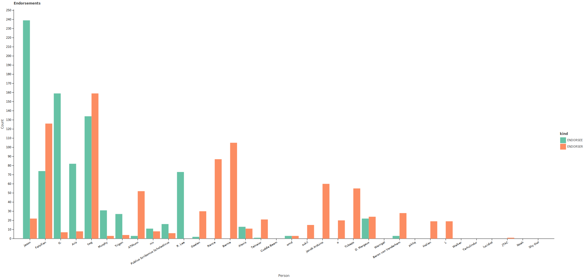

[Data in plain text](statistics/voter_endorsee_all_times.txt)

|                          Voter | Times endorsee |
| :------------------------------ | -----------------------: |
|                           Jason |                      239 |
|                       Falsifian |                       74 |
|                              G. |                      159 |
|                            Aris |                       82 |
|                             twg |                      134 |
|                          Murphy |                       31 |
|                          Trigon |                       27 |
|                          ATMunn |                        3 |
|                             nix |                       11 |
| Publius Scribonius Scholasticus |                       16 |
|                          R. Lee |                       73 |
|                          Gaelan |                        2 |
|                           Rance |                        0 |
|                          Bernie |                        0 |
|                          Alexis |                       13 |
|                        Telnaior |                        1 |
|                     Cuddle Beam |                        0 |
|                             omd |                        3 |
|                           sukil |                        0 |
|                   Jacob Arduino |                        0 |
|                               o |                        0 |
|                          Tcbapo |                        0 |
|                      D. Margaux |                       22 |
|                        Warrigal |                        0 |
|             Baron von Vanderham |                        3 |
|                           pikhq |                        0 |
|                          Halian |                        0 |
|                               L |                        0 |
|                          Walker |                        0 |
|                     Tarhulindur |                        0 |
|                        lucidiot |                        0 |
|                            JTAC |                        0 |
|                            Noah |                        0 |
|                         Shy Owl |                        0 |

As is usual, the numbers decrease down the list, indicating that more active people are endorsed more. Once again, this
makes sense, as people who vote more are more active, and thus are more likely to be trusted, more likely to be author
proposals (and endorsing the author is relatively common), and, most importantly, more likely to have controlled a
zombie at some point. "Endorse <master> on all proposals" is an extremely common vote for zombies, which means that
the endorsement counts are artificially inflated for people who have ever controlled a zombie. This is the case for at
least Jason, Falsifian, G., Aris, twg, R. Lee, and D. Margaux. Overall, Jason, G., and twg have the most endorsements.

**MOST INFLUENTIAL: Jason**

### 2.4 Non-total Endorsements

As a bureaucratic efficiency, I have a way to automatically cast the same vote on all proposals within an assessment.
The most common use of this has been zombies endorsing masters, but there are occasionally things like "FOR on all" or
"endorse the author on all". Since the latter is extremely rare (happening only twice in my data), it can be safely
ignored for this analysis. If I recall correctly, there were a few other instances of non-zombie endorsements on all
decisions in an assessment, but they are infrequent enough that this analysis is not invalidated.

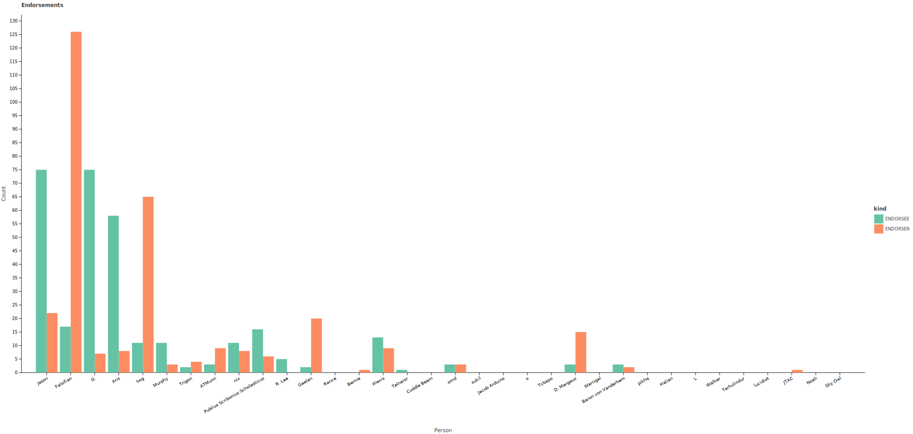

[Data in plain text](statistics/voter_endorsee_non_total_times.txt)

|                          Voter | Times endorsee (non-total) |
| :------------------------------ | -----------------------------: |
|                           Jason |                             75 |
|                       Falsifian |                             17 |
|                              G. |                             75 |
|                            Aris |                             58 |
|                             twg |                             11 |
|                          Murphy |                             11 |
|                          Trigon |                              2 |
|                          ATMunn |                              3 |
|                             nix |                             11 |
| Publius Scribonius Scholasticus |                             16 |
|                          R. Lee |                              5 |
|                          Gaelan |                              2 |
|                           Rance |                              0 |
|                          Bernie |                              0 |
|                          Alexis |                             13 |
|                        Telnaior |                              1 |
|                     Cuddle Beam |                              0 |
|                             omd |                              3 |
|                           sukil |                              0 |
|                   Jacob Arduino |                              0 |
|                               o |                              0 |
|                          Tcbapo |                              0 |
|                      D. Margaux |                              3 |
|                        Warrigal |                              0 |
|             Baron von Vanderham |                              3 |
|                           pikhq |                              0 |
|                          Halian |                              0 |
|                               L |                              0 |
|                          Walker |                              0 |
|                     Tarhulindur |                              0 |
|                        lucidiot |                              0 |
|                            JTAC |                              0 |
|                            Noah |                              0 |
|                         Shy Owl |                              0 |

Here, we see that several people with many endorsements have a much smaller number of non-total endorsements: Jason,
Falsifian, G., Aris, twg, Murphy, Trigon, and R. Lee. This shows that the majority of their endorsements were not
organic, which means that, though it increases the endorsee's influence over the gamestate, they do not indicate
influence over fellow (active) Agorans. Under this count, Jason, G., and Aris have the most endorsements, with twg, the
former third place, dropping to 7th place.

**MOST INFLUENTIAL (tied): G., Jason**

### 2.5 Determinative Votes

Let a voter be determinative on a decision if e voted FOR or AGAINST on that decision and if flipping only eir vote (
while still updating endorsements and other conditional votes (at least those that I have implemented to be
automatically evaluated)) to AGAINST or FOR respectively would cause the outcome of that decision to change. Note that
this definition permits multiple voters to be determinative on a single decision. There a few ways a voter could be
determinative (all requiring em to vote in the opposite way than the eventual result): the decision could be very
close (which would likely mean many voters are determinative), e could have sufficient endorsements, or e could have
sufficient voting strength.

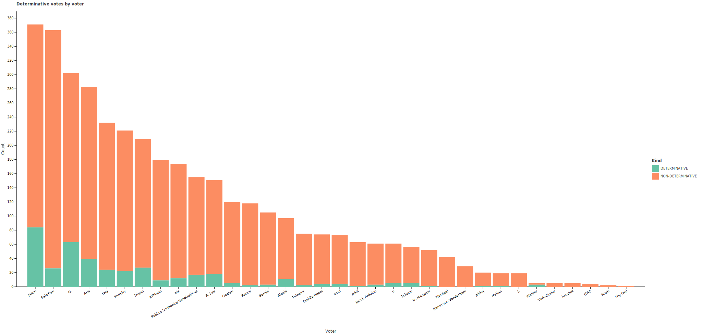

[Data in plain text](statistics/voter_determination_times.txt)

|                          Voter | Decisions determinative |
| :------------------------------ | ------------------------: |
|                           Jason |                        84 |
|                       Falsifian |                        26 |
|                              G. |                        63 |
|                            Aris |                        39 |
|                             twg |                        24 |
|                          Murphy |                        22 |
|                          Trigon |                        27 |
|                          ATMunn |                         9 |
|                             nix |                        12 |
| Publius Scribonius Scholasticus |                        17 |
|                          R. Lee |                        18 |
|                          Gaelan |                         5 |
|                           Rance |                         2 |
|                          Bernie |                         3 |
|                          Alexis |                        11 |
|                        Telnaior |                         2 |
|                     Cuddle Beam |                         4 |
|                             omd |                         4 |
|                           sukil |                         1 |
|                   Jacob Arduino |                         3 |
|                               o |                         5 |
|                          Tcbapo |                         5 |
|                      D. Margaux |                         1 |
|                        Warrigal |                         0 |
|             Baron von Vanderham |                         0 |
|                           pikhq |                         1 |
|                          Halian |                         1 |
|                               L |                         0 |
|                          Walker |                         3 |
|                     Tarhulindur |                         0 |
|                        lucidiot |                         0 |
|                            JTAC |                         0 |
|                            Noah |                         0 |
|                         Shy Owl |                         0 |

These data reveal that voters are generally determinative on very few decisions. This suggests that voters largely tend
to agree, which would result in a single defector not actually changing the outcome of the decision. Other than that,
these data, as always, show that people who vote more tend to be more influential. G. and Jason are determinative on
the most decisions, which is consistent with their high number of endorsements, and Aris was determinative on
fewer decisions then them while also having fewer endorsements; this helps confirm the hypothesis that endorsements 
contribute to voters being determinative.

**MOST INFLUENTIAL: Jason**

To confirm the hypothesis about why voters are influential on decisions, we can look at a few examples of proposals
with a very large or very small number of decisive voters (full data
[here](statistics/proposal_determinative_voter_count.txt), note that it excludes proposals with no determinative
voters).

One example with 9 determinative voters is P8301:
```
PROPOSAL 8301 (Consolidated Regulatory Recordkeeping v2)
AUTHOR: Aris
FOR (9): Alexis, Aris, Bernie, Falsifian, Gaelan, Jason, Rance, omd, twg
AGAINST (2): G.$, o
PRESENT (0): 
BALLOTS: 11
AI (F/A): 27/7 (AI=3.0)
POPULARITY: 0.636
OUTCOME: ADOPTED
```

This is just a close decision, which makes every FOR voter determinative. There are many examples of proposals like
this, mainly with high AIs. The AI-1 decision with the highest number of determinative voters (6) is Proposal 8198:
```
PROPOSAL 8198 (Be gone, foul demon!)
AUTHOR: Jason
FOR (7): Aris, Falsifian, Jason, Murphy, Trigon, Walker, twg!
AGAINST (4): G.$, R. Lee, Tarhulindur, Telnaior
PRESENT (0): 
BALLOTS: 11
AI (F/A): 19/13 (AI=1)
POPULARITY: 0.273
OUTCOME: ADOPTED
```
This helps to confirm that most decisions with many determinative voters are decisions that are closely decided.

Looking at some proposals with low numbers of determinative voters should help confirm that voters can be determinative
due to unusually high voting strengths or numbers of endorsements. One example with a single determinative voter (PSS)
is Proposal 8471:
```
PROPOSAL 8471 (Only the PM can be arbitrary!)
AUTHOR: R. Lee
CLASS: ORDINARY
CHAMBER: JUSTICE
FOR (6): ATMunn, Cuddle Beam, G.*, R. Lee~, Tcbapo, twg
AGAINST (5): Falsifian, Jason, Murphy, Publius Scribonius Scholasticus%, omd
PRESENT (2): Trigon, nix%
BALLOTS: 13
AI (F/A): 20/17 (AI=1.7)
POPULARITY: 0.077
OUTCOME: REJECTED
```

This confirms that higher-than-normal voting strength can make a voter determinative. Another example with a single
determinative voter is Proposal 8487, which had omd as its sole determinative voter:
```
PROPOSAL 8288 (Glitteral)
AUTHOR: omd
FOR (11): Alexis$, Aris, Bernie, Falsifian, G., Gaelan, Jason, Rance, o, omd, twg
AGAINST (0): 
PRESENT (0): 
BALLOTS: 11
AI (F/A): 34/0 (AI=1.0)
POPULARITY: 1.000
OUTCOME: ADOPTED
[
Bernie: Endorsement of twg
Falsifian: Conditional resolved: no Notice of Veto was published: Endorsement of omd
G.: twg is Treasuror: Endorsement of twg
Gaelan: twg is the Treasuror: Endorsement of twg
Rance: Endorsement of Jason
o: twg is Treasuror: Endorsement of twg
twg: Endorsement of omd
]
```
This is an unusual decision because a majority of its voters ultimately endorse a single person (though most of those
endorsers actually endorsed twg, who then endorsed omd). This means that omd alone ultimately controlled the outcome
of the decision. This is a (rather extreme) example of how endorsements can result in a voter being determinative.

### 4.3 Result Agreement by Voter

A voter "agrees" with the result of a decision if e voted FOR, and the resolution was ADOPTED; or if e voted AGAINST,
and the resolution was REJECTED. Alternatively, a voter "disagrees" with the result of a decision if e voted AGAINST,
and the resolution was ADOPTED; or if e voted FOR, and the resolution was REJECTED. Note that this definition does not
imply a voter agrees or disagrees with the result of every decision -- if e voted PRESENT or if the decision was
resolved FAILED QUORUM, e neither agrees nor disagrees with the result. Correleation is not causation, but having an
abnormally high result agreement rate could 

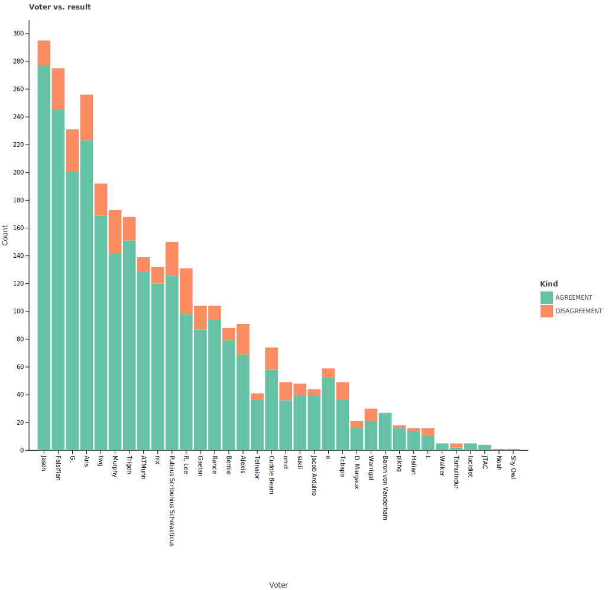

[Raw agreement rate data](statistics/voter_result_agreement_rate.txt) \
[Raw disagreement rate data](statistics/voter_result_disagreement_rate.txt)

|                          Voter | Result agreement rate |
| :------------------------------ | --------------------------: |
|                           Jason |                        0.75 |
|                       Falsifian |                        0.67 |
|                              G. |                        0.67 |
|                            Aris |                        0.79 |
|                             twg |                        0.73 |
|                          Murphy |                        0.64 |
|                          Trigon |                        0.72 |
|                          ATMunn |                        0.72 |
|                             nix |                        0.69 |
| Publius Scribonius Scholasticus |                        0.81 |
|                          R. Lee |                        0.65 |
|                          Gaelan |                        0.73 |
|                           Rance |                        0.80 |
|                          Bernie |                        0.75 |
|                          Alexis |                        0.71 |
|                        Telnaior |                        0.49 |
|                     Cuddle Beam |                        0.78 |
|                             omd |                        0.49 |
|                           sukil |                        0.63 |
|                   Jacob Arduino |                        0.66 |
|                               o |                        0.85 |
|                          Tcbapo |                        0.66 |
|                      D. Margaux |                        0.31 |
|                        Warrigal |                        0.50 |
|             Baron von Vanderham |                        0.90 |
|                           pikhq |                        0.80 |
|                          Halian |                        0.74 |
|                               L |                        0.58 |
|                          Walker |                        1.00 |
|                     Tarhulindur |                        0.40 |
|                        lucidiot |                        1.00 |
|                            JTAC |                        1.00 |
|                            Noah |                        0.50 |
|                         Shy Owl |                        1.00 |


The above graph shows that Agorans tend to agree a lot, with most people agreeing with proposal outcomes upwards of two-
thirds of the time. The results most often agree with PSS's vote, making em the most influential and suggesting that e
had some magical way of influencing the outcome of decisions, or it could just be that e agrees with the populace most
of the time. Although e has a relatively high average voting, G. has as significantly higher average voting strength, but a significantly
lower result agreement rate. So it appears that this just indicates that e often agrees with the majority or that
the majority often agrees with em (based on eir office-holding or vote comments).

The most often that any voter disagreed with the result of a decision was 26% by L (mostly a zombie), and the most of
any common voter was 23% by Alexis. Cuddlebeam's disagreement with other Agorans show up here, too. E disagreed with the
result of decisions 22% of the time.

**MOST INFLUENTIAL: PSS**

## 3. The Most Influential Agoran

Influencer summary:
* Submitted proposals: Aris
* Adopted proposals: Aris
* Adopted proposal rate: PSS.
* Adopted proposal words: Aris
* Authored proposal margin (all): PSS
* Authored proposal margin (adopted): PSS
* Authored proposal margin (rejected): G.
* Vote count: Jason
* Voting strength max: Trigon
* Voting strength average: G.
* Endorsements: Jason
* Endorsements (non-total) (tied): G., Jason
* Determinative votes: Jason
* Result agreement: PSS

| Person | Influence Scores | Total |
| :----- | :--------------- | ----: |
| Aris   | 1 + 1 + 1        |   3.0 |
| PSS    | 1 + 1 + 1 + 1    |   4.0 |
| G.     | 1 + 1 + 0.5      |   2.5 |
| Jason  | 1 + 1 + 0.5 + 1  |   3.5 |
| Trigon | 1                |   1.0 |

Based on this analysis, Publius Scribonius Scholasticus is the most influential Agoran and should therefore immediately
be banished and reprimanded for daring to influence the game. Once that is done, Agora will finally be safe from the
influencer and be able to proceed as a more equitable and less influenced society.

## 4. Analysis but without the pretense

Now that the question burning on everyone's minds has been answered, there are a few other interesting datasets that I
have available but don't fit in nicely with the influencer theme.

### 4.1 Voter-Voter Agreement

By associating each vote resolution with a number (-1 for AGAINST, 0 for PRESENT, and 1 for FOR), the correlation
between people's voting can be calculated. This yields the following chart:

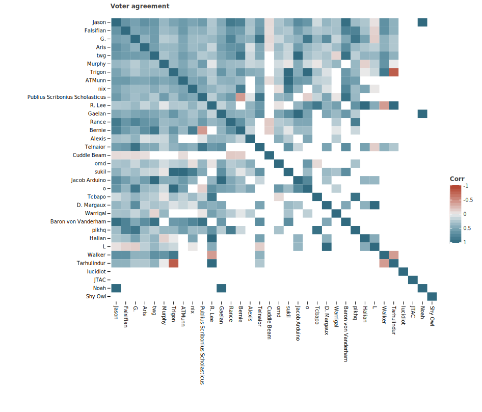

Looking at the top left of the chart, we see a sea of blue, indicating that the people who vote the most tend to agree
with each other a lot. One small exception to this trend is Bernie & PSS, who happen to have a negative correlation.
Bernie was a zombie for all of eir votes in these data, so this doesn't really indicate anything about Bernie emself,
but eir masters over the time period -- Jason and twg, though both of them generally agreed with PSS overall, suggesting
this is just an interesting anomaly.

The next deviation from the trend is Cuddlebeam, who apparently disagrees with many of the common voters, and doesn't
actively agree with the rest. This is sufficiently strong to suggest a pattern of Cuddlebeam being a _**rebel**_ when
it comes to voting.

Overall, however, this chart suggests that Agorans agree with each other a lot when voting.

### 4.2 Vote Kinds by Voter

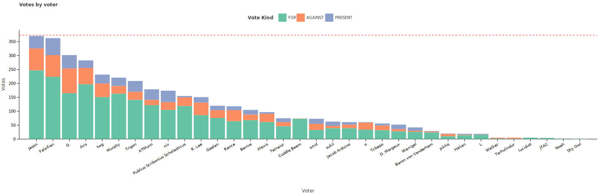

Looking at the above graph, it is clear that FOR is by far the most common vote. This also suggests that Agorans agree
with each a lot, but this time it suggests voters tend to agree with authors. One voter, however, takes this philosophy
to the extreme -- Cuddlebeam. Cuddlebeam regularly votes FOR all proposals in a distribution while claiming not to have
read them. In fact, e has only voted AGAINST a single proposal (out of the 69 e voted in) in these data: Proposal 8271.
This likely contributes to eir low agreement rate with other Agorans. Other Agorans vote FOR a lot, but nowhere near
as much as Cuddlebeam does.

### 4.3 Voter-Author Agreement

By calculating the same vote numbers as above (1 for FOR, etc.) and averaging them for each voter's votes on each author's proposals,
the agreement between the voter and the author can be calculated.

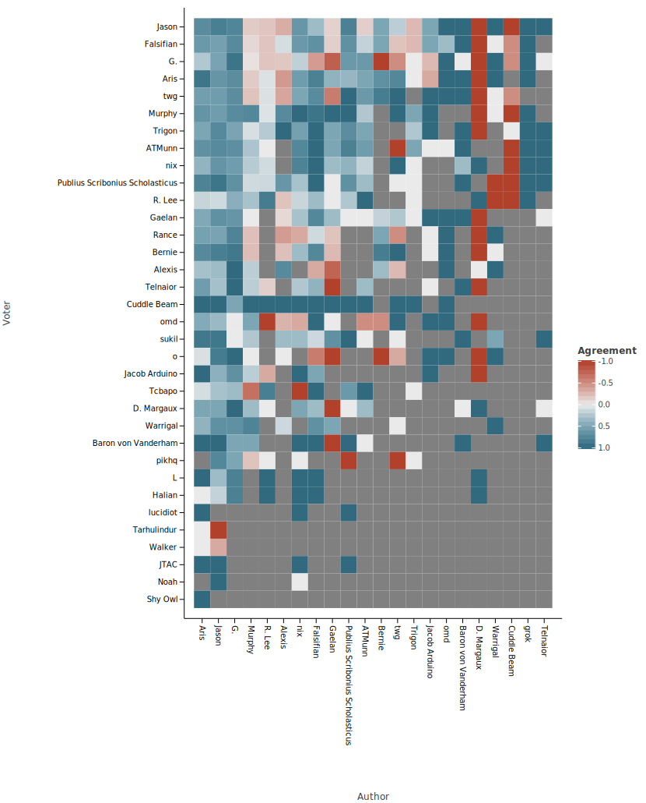

[Note: the number of votes by the voter decreases top-to-bottom, and the number of proposals submitted by the author
decreases left-to-right.]

Some interesting things are immediately apparent on this graph. One is Cuddlebeam's very dark blue line as a voter,
showing eir pattern of voting FOR on most proposals. Another is the sea of blue to the top left, showing that the most
common authors tend to receive many FOR votes on their proposals, as expected by their high proposal adoption rates.
Yet another is D. Margaux's author line having both very dark blue and very dark red. The extreme values are expected,
as e has only submitted two proposals. One of these proposals was controversial:
```
PROPOSAL 8209 (AFK Reform Act v1.1)
AUTHOR: D. Margaux
FOR (5): D. Margaux, Halian, L, R. Lee, nix
AGAINST (9): Aris, Falsifian, G.$, Jacob Arduino, Jason, Murphy, Telnaior, Trigon, twg@
PRESENT (0): 
BALLOTS: 14
AI (F/A): 15/27 (AI=2.0)
POPULARITY: -0.286
OUTCOME: REJECTED
```
while the other was not:
```
PROPOSAL 8307 (Deregistration)
AUTHOR: D. Margaux
FOR (0): 
AGAINST (10): Aris, Bernie, Falsifian, G.$, Gaelan, Jason, Rance, o, omd, twg
PRESENT (1): Alexis
BALLOTS: 11
AI (F/A): 0/31 (AI=3.0)
POPULARITY: -0.909
OUTCOME: REJECTED
```

The people who voted FOR on Proposal 8209 did not vote on Proposal 8307, meaning they have a value of +1 for agreement
with D. Margaux.

Other than that, there are common speckles of red in a field of blue, indicating overall agreement rates of voters
with authors are relatively high, confirming the earlier observation that the most common vote is FOR.

### 4.4 Endorsements by Endorsee/Endorser

The below graphs show how often endorsements are by endorsee/endorser pair. Non-total endorsements are defined as
above.

#### All endorsements
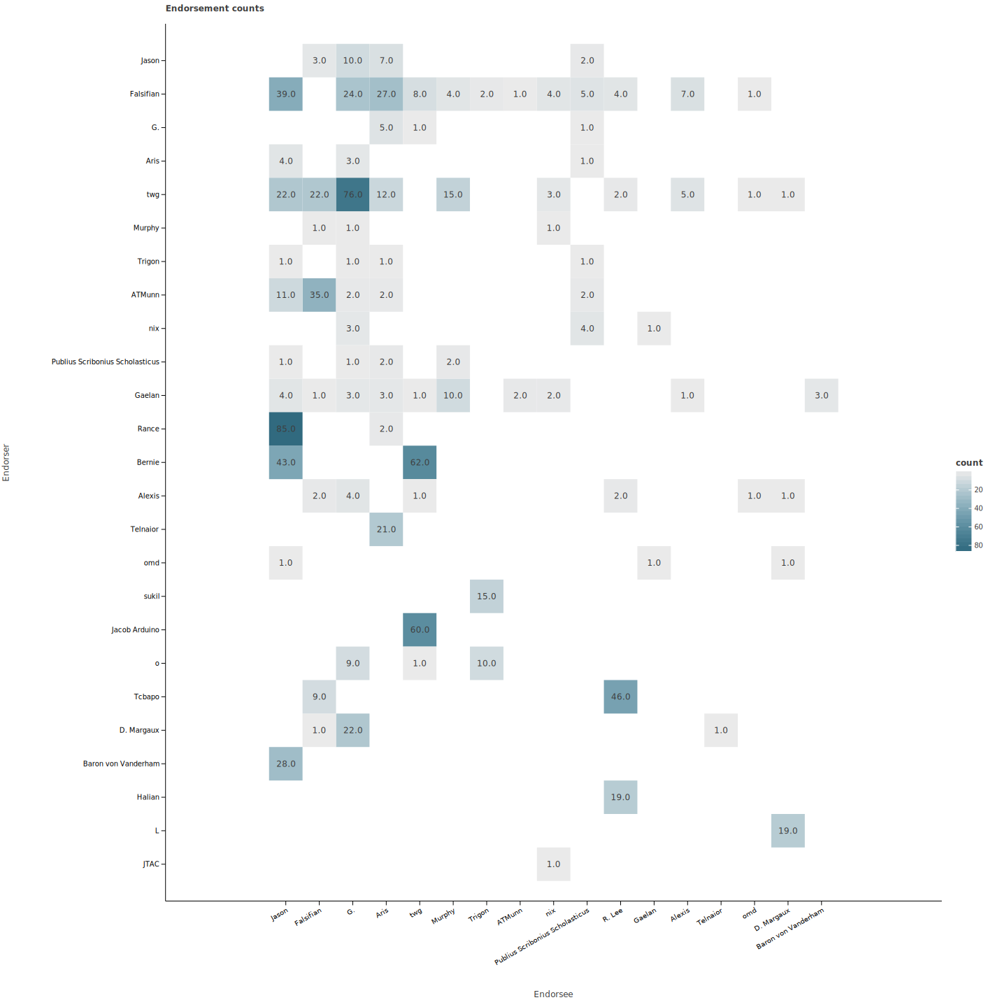

An interesting thing about this graph is that it shows master/zombie relationships very clearly, since they are
generally the darkest squares in the grid. For instance, it is clear that twg was G.'s zombie at one point and that
Jacob Arduino was twg's zombie at one point. The next graph actually makes normal endorsements visibly distinct.

#### Non-total endorsements
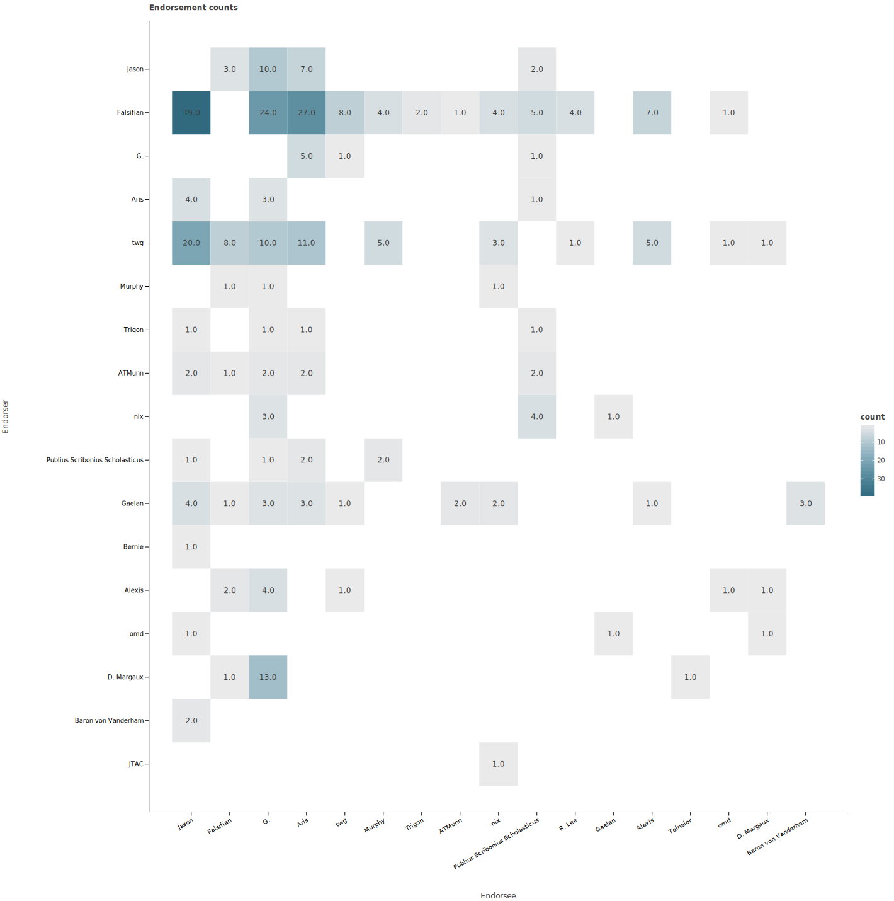

Here, it is clear who endorses other people the most - Falsifian. This is in part because e has frequently endorsed
the author of a proposal in order to help allow the author to self-kill a proposal if e notices as bug in it. TWG has
also endorsed people a lot, for what appears to be largely the same reason; in fact, e submitted a proposal that would
have allowed authors to formally cancel proposals, so it makes sense that e tried to emulate that in voting.

## 5. Conclusion

This thesis was based on a very silly premise, but hopefully you, dear reader, found it at least mildly interesting.
The source code for the generation of the stats and graphs will be available in the AgoraNomic/assessor repository.
